:data-uri:
:toc2:
:bpmproduct: link:https://access.redhat.com/site/documentation/en-US/Red_Hat_JBoss_BPM_Suite/[Red Hat's BPM Suite 6 product]
:mwlaboverviewsetup: link:http://people.redhat.com/jbride/labsCommon/setup.html[Middleware Lab Overview and Set-up]

image::images/rhheader.png[width=900]

:numbered!:
[abstract]
== User Task Escalation

:numbered:

== Introduction

Please note that the terms _User Task_ and _Human Task_ are both used to denote tasks in processes to be performed by human actors. In this document we will predominantly use the term _User Task_.

An important aspect of business processes is human task management. While some of the work performed in a process can be executed automatically, some tasks need to be executed by human actors.

BPM Suite 6 supports a User Task node inside processes for modeling this interaction with human actors. This User Task node allows process designers to define the properties related to the task that the human actor needs to execute, like for example the type of task, the (potential) owners, or the data associated with the task.

The life cycle of a User Task is different from the process lifecycle, and is managed by the Human Task Service. The implementation of this service is based upon the _WS-HumanTask_ specification.

The full version of the WS-HT specification can be found http://docs.oasis-open.org/bpel4people/ws-humantask-1.1-spec-cs-01.pdf[here]. The following diagram describes the different states and transitions for user tasks:

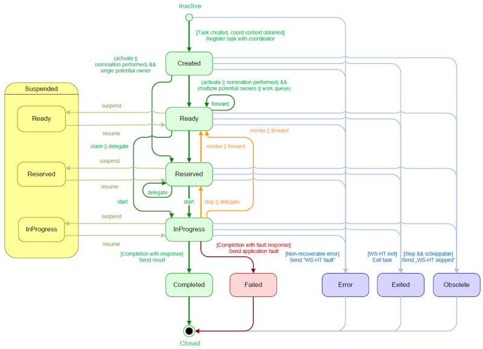

== User Task Escalation

Escalations allow the specification of a date or time before which the task or sub task has to reach a specific state. If the timeout occurs, a notification and/or task reassignment is performed. Several deadlines are specified which differ in the point when the timer clock starts and the state which has to be reached with the given duration or by the given date. They are:

* Start Deadline : Specifies the time until the task has to start, i.e. it has to reach the state _InProgress_ (or put differently, the escalation will be triggered if the task state is _Created_, _Ready_ or _Reserved_). The deadline can be calculated at runtime using expressions and enables the use of custom calendars. The time starts to be measured from the time at which the task was created.

* Completion Deadline : Specifies the time until the task gets due, i.e. it has yo reach one of the final states _Completed_, _Failed_, _Error_, _Exited_, _Obsolete_. The deadline can be calculated at runtime using expressions and enables the use of custom calendars. The time starts to be measured from the time at which the task was created.

Escalations come in two forms:

* Notification : used to inform people about the status of a task. The default implementation in BPMS uses email for notification, and leverages the mail subsystem of the underlying JBoss EAP app server.

* Task Reassignment : used to replace the potential owners of a task when an escalation is triggered. The new potential owners my represent individual users or groups, or a combination of both. The task is set to status _Ready_ after reassignment.

A task may have multiple start deadlines and completion deadlines associated with it. Deadlines will only be executed as long as the escalation conditions (i.e. the state of the task when the escalation triggers) are met.

=== Configuring User Task Escalation

In the BPMS Web designer, escalation (reassignment as well as notification) can be configured using dialog boxes from within the User Task properties.

==== Reassignment

In the BPMS Web designer, select the User Task you want to configure a reassignment escalation for, and in the properties pane on the left, select the Reassignment box.

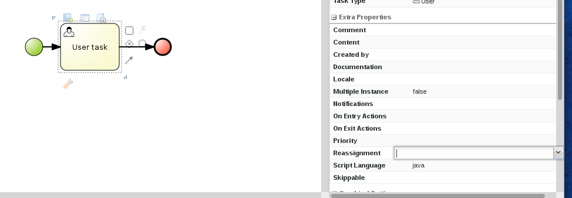

In the dialog box, click on the _Add Reassignment_ button to enter a new reassignment, and fill in the desired values for user, group, expiry time and type (_Not Started_ or _Not Completed_).

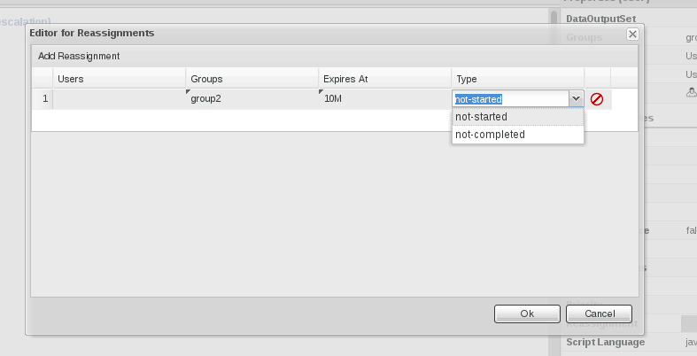

Some things to note:

* Reassignment can be done to a particular user, a group of users or a combination of the two.
* Multiple users and/or groups can be specified with a comma separated list of user names an/or group names
* The expiry delay is specified according to the following regular expression : `([+-])?((\\d+)[Dd])?\\s*((\\d+)[Hh])?\\s*((\\d+)[Mm])?\\s*((\\d+)[Ss])?\\s*((\\d+)([Mm][Ss])?)?`. +
Some examples:
** `3H 30M` : 3 hours, 30 minutes
** `1D` : 1 day
** `1500MS` : 1500 milliseconds
* The escalation time is calculated by adding the expiry delay to the current time at the moment the User Task is created. If a business calendar has been specified for the BPM Suite engine, it will be taken into account to calculate the escalation time.
* Multiple expiration delays can be specified with a comma separated list.
* Implementation detail : the configured escalation is passed to the User Task instance through predefined data input variables, named _NotStartedReassign_ and _NotCompletedReassign_ (_NotStartedNotify_ and _NotCompletedNotify_ for notifications). The data input variable takes a format `[users:<comma separated list of users>|groups:<comma separated list of groups>]@[<escalation expiry time>]`. If multiple escalations need to be defined, they should be separated by the `^` symbol.  +
Using the input variables directly allows to define escalations on User Tasks in e.g. the Eclipse based BPMN2 designer, which has no UI to define escalations on a User Task.
* _Variable substitution_ : for a more dynamic reassignment logic, expressions can be used instead of hardcoded values for users, groups and expiry delay. +
At runtime (when the User task instance is created) the expressions will be resolved to process variables +
Example : `[users:#{reassignWhenNotStarted}|groups:]@[#{reassignWhenNotStartedTime}]`

==== Notification

By default in BPMS, notification escalation is handled through email, and as such requires more configuration than for reassignment. The setup required for BPMS in order to be able to send email will be discussed in the section about _Config and Deploymnent_

To configure a notification escalation on a User task, in the BPMS Web designer select the User Task, and in the properties pane on the left, select the Notifications box.

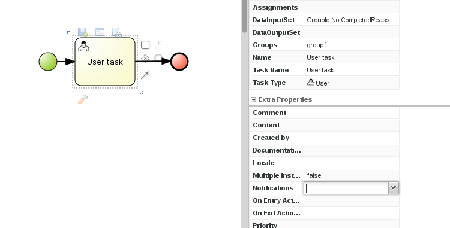

In the dialog box, click on the _Add Notification_ button to enter a new notification, and fill in the desired values for type (_Not Started_ or _Not Completed_), expiry delay, from, to (users and/or groups), reply to, subject and body.

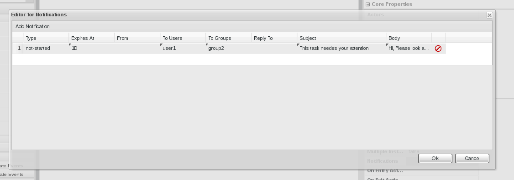

Some things to note:

* Mandatory fields are _To Users_ and/or _To Groups_, _Type_ and _Expiry_. You probably need a subject and a body for the email. _From_ and _Reply To_ are optional. +
(if _From_ is not set as part of the notification definition, it should be set a spart of the mail subsystem configuration, see below).
* The expiry delay is specified in the same way as for reassignments.
* Multiple users and/or groups can be specified with a comma separated list of user names an/or group names.
* Implementation detail : the configured escalation is passed to the User Task instance through a predefined data input variables, named _NotStartedNotify_ and _NotCompletedNotify_. The data input variable takes a format `[from:<from user>|tousers:<comma separated list of users>|togroups:<comma separated list of groups>|replyTo:<>replyto user|subject:<subject>|body:<body>]@[<escalation expiry time>]`. If multiple escalations need to be defined, they should be separated by the `^` symbol.  +
Using the input variables directly allows to define escalations on User Tasks in e.g. the Eclipse based BPMN2 designer, which has no UI to define escalations on a User Task.
* _Variable substitution_ : expressions can be used instead of hard coded values in the notification string. +
At runtime (when the User task instance is created) the expressions will be resolved to process variables +
Example : `[from:|tousers:#{notifyUsers}|groups:|replyTo:|subject:#{notifySubject}|body:#{notifyBody}]@[#{notifyWhenNotStartedTime}]`
* _Templating_ : for the subject and the body of the notification email, a templating mechanism (_MVEL templating_) is used. This allows to inject task specific data in the subject and or header of the email.
** To inject a value in the subject or body, use a `${<variable name>}` expression in the subject or body string.
** The following variables are available:
*** taskId : the id of the task
*** workItemId : the id of the work item associated with the task
*** processInstanceid : the id of the process instance to which the task belongs
*** expirationTime : the expiration time for this task (note: this is not the same as the escalation expiry delay - the task exiration time or _Due Date_ is an attibute of the User Task).
*** owners : the list of potential owners for this task
*** doc : the content of the task, in the form of a map of task variables names and values. To access a particular item in the map, use `${doc["<task variable name>"]}`
** More details about MVEL templating can be found link:http://mvel.codehaus.org/MVEL+2.0+Templating+Guide[here].
* In BPMS, users and groups are abstract entities. User and group details like email address, group membership etc are not maintained inside BPMS, but rather in an external system (typically in an LDAP directory). BPMS provides a pluggable mechanism to obtain the user information from where it is maintained.

== Prerequisites

The remainder of this documentation provides instructions for installation, configuration and execution of this reference architecture in Red Hat's Partner Demo System.
The following is a list of pre-requisites:

. OPENTLC-SSO credentials
+
`OPENTLC-SSO` user credentials are used to log into the Red Hat Partner Demo System (PDS).
If you do not currently have an `OPENTLC-SSO` userId, please email: `OPEN-program@redhat.com`.

. Familiarity with Partner Demo System
+
If you are not already familiar with Red Hat's `Partner Demo System`, please execute what is detailed in the {mwlaboverviewsetup} guide.
Doing so will ensure that you are proficient with the tooling and workflow needed to complete this reference architecture in an OpenShift Platform as a Service environment.

. Familiarity with {bpmproduct}

== Provision BPM Suite 6 Application

. Open the `Openshift Explorer` panel of the `JBoss` perspective of JBDS
. Right-click on the previously created connection to `broker00.ose.opentlc.com`.
+
Using your `OPENTLC-SSO` credentials, a connection to `broker00.ose.opentlc.com` should already exist after having completed the {mwlaboverviewsetup} guide.

. Select: `New -> Application` .
+
Since you have already created a domain from the previous introductory lab, the workflow for creation of a new application will be slightly different than what you are used to.
In particular, the OSE plugin will not prompt you for the creation of a new domain.

. A popup entitled: `New or existing OpenShift Application` should appear:
+
Populated its fields as follows:

.. In the `Name` text box, enter: `bpmsapp`
.. From the `Type` drop-down, select: JBoss BPMS 6.0 (rhgpe-bpms-6.0)
.. From the `Gear profile` drop-down, select: pds_medium
.. Click `Add` button in the `Embedded Cartridges` section.
+
Select `MySQL 5.5` and press `OK`
+
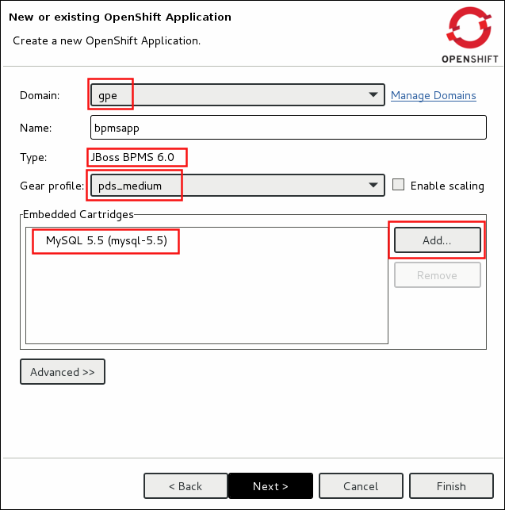
. Click `Next`
. A new dialogue appears entitled `Set up Project for new OpenShift Aplication`.
+
Check the check box for `Disable automatic maven build when pushing to OpenShift`.
Afterwards, Click `Next`.

. A new dialogue appears entitled `Import an existing OpenShift application`.
+70
Even though it will not be used, you will be forced to clone the remote git enabled project associated with your new OpenShift application.
Select a location on your local filesystem where the git enabled project should be cloned to.
+
image::images/gitclonelocation_bpm.png[]

. Click `Finish`
. The OSE plugin of JBDS will spin for a couple of minutes as the remote BPM Suite 6 enabled OpenShift application is created.
. Eventually, the OSE plugin will prompt with a variety of pop-up related details regarding your new application.
+
Click through all of them except when you come to the dialogue box entitled `Publish bpmsapp?`.
For this dialogue box, click `No`
+
image::images/publishbpmslab.png[]

=== BPM Suite 6 App Verification

. Using the `Remote System Explorer` perspective of JBDS, open an SSH terminal and tail the `bpms/standalone/log/server.log` of your remote BPM Suite 6 enabled OSE application
. Log messages similar to the following should appear:
+
image::images/newbpmlogfile.png[]

== Config and Deployment

=== BPM Suite 6: Add additional users and roles

By default in BPMS, users and roles are defined in a properties file. The BPM Suite 6 OSE installation defines one user, _jboss/brms_, but to demonstrate User Task escalations we need to add additional users and groups.

BPM Suite 6 provides a command-line tool (`bin/add-users.sh`) to add users and groups, but this command line tool is not installed as part of the BPM Suite 6 cartridge, so we will add them directly to the properties file.

We will create the following additional users:

----
user: user10, password: user10@@, roles: user, group1
user: user11, password: user11@@, roles: user, group1
user: user20, password: user20@@, roles: user, group2
user: user21, password: user21@@, roles: user, group2
user: user30, password: user30@@, roles: user, group3
user: user31, password: user31@@, roles: user, group3
user: busadmin, password busadmin1@@, roles: user, Administrators
----

. Using the `Remote System Explorer` perspective of JBDS, open an SSH terminal, and cd to `bpms/standalone/configuration`.

. Open the `application-users.properties` file with `vi` or `nano`, and append the following lines to the end of the file:
+
----
user10=f6bc37c386693ad0da7553a7ea5bd291
user11=5043ab117e0ff7f8f89ddd6193ad438a
user20=f7ae6ed276148f74d3a71e843d65a7da
user21=7fedec5688c20a1c6a76db6b7c190c87
user30=e5e7ac4e54c49fcce973e02970b26d97
user31=b30dc13a8c771193dd936b2d241fdaad
busadmin=60c70bdc70edae8c31e8e3dbbcf2479a
----
+
Save the change and quit.

. Open the `application-roles.properties` file with `vi` or `nano`, and append the following lines to the end of the file:
+
----
user10=user,group1
user11=user,group1
user20=user,group2
user21=user,group2
user30=user,group3
user31=user,group3
busadmin=user,Administrators
----
+
Save the change and quit

Verify the changes by logging in into the BPM Console using the username/password combinations of the newly created users.

=== BPM Suite 6 : Persistent timer setup

Task escalation relies heavily on timers to provide its functionality. Out of the box BPM Suite is configured with a JVM based timer configuration. This means that timer definitions won't survive a server restart. BPM Suite can also be configured to use a persistent timer mechanism, based on the well-known link:http://http://quartz-scheduler.org/[Quartz scheduling framework].

Configuration of BPM Suite 6 to use Quartz based timers is done by setting an environment variable `org.quartz.properties` whose value points to a Quartz configuration file.

The BPM Suite cartridge in the Partner Demo system is configured to use the Quartz based timer configuration, but uses a RAM based persistence store, which is also volatile in nature.

If you want to upgrade to a JDBC based persistence store, please follow the steps outlined in link:bpm_persistent_timer.adoc[BPM Suite Persistent Timer Setup].

=== BPM Suite 6 : Notification mail subsystem setup

To send out notification emails, BPM Suite looks up a Javamail session in the JNDI tree of the application server. The JNDI name is set by the `org.kie.mail.session`, and defaults to `mail/jbpmMailSession`.

We can configure the Javamail subsystem which is part of JBoss EAP to publish a Javamail session in the JNDI tree:

. ssh into the `bpmsapp` gear, and cd to `bpms/standalone/configuration`
. Open the `standalone.xml` file with `vi` or `nano`.
. Set the value of the `org.kie.mail.session` environt variable. Add the following line to the `<system-properties>` section:
+
----
<property name="org.kie.mail.session" value="java:jboss/mail/Default"/>
----

. Locate the configuration of the `mail` subsystem (around line 321).
. Adjust the existing mail-session configuration to suit your environment. For example, to connect to GMail SMTP the configuration looks like (adjust from, user name and password accordingly) :
+
----
<mail-session jndi-name="java:jboss/mail/Default" from="username@gmail.com">
    <smtp-server ssl="true" outbound-socket-binding-ref="mail-smtp">
        <login name="username@gmail.com" password="password"/>
    </smtp-server>
</mail-session>
----

. Adjust the `mail-smtp` outbound socket binding configuration, towards the end of `standalone.xml`. For GMail this should look like:
+
----
<outbound-socket-binding name="mail-smtp">
    <remote-destination host="smtp.gmail.com" port="465"/>
</outbound-socket-binding>
----

. Save and quit
. Restart the `bpmsapp` gear for the changes to take effect
+
----
$ gear stop
$ gear start
----

=== BPM Suite 6: User Info configuration

As mentioned above, _Users_ and _Groups_ are abstract entities in BPM Suite. This means that BPM suite does not maintain data about users and groups, but these are obtained from an external source, like a LDAP directory. The advantage of this approach is that user and group information does not need to be duplicated inside BPM Suite. +
BPM Suite obtains the required user and group information through the use of _callbacks_, which are implementations of the `org.kie.api.task.UserGroupCallback` and `org.kie.internal.task.api.UserInfo` interfaces. +
It is up to the developer to provide an implementation of these interfaces to bridge between BPMS Suite and the user information store they want to leverage. +
BPM Suite provides a out of the box number of implementations, for use with LDAP or RDBMS based user stores.

By default BPM Suite uses properties files to obtain user and group information. Users and groups are defined in `application-users.properties` and `application-roles.properties`. Additional user information (like email address) is kept in another property file, `userinfo.properties`, in `/business-central.war/WEB-INF/classes`.

The `userinfo.properties` file has entries in the format :

----
username=email:locale:displayname:[member,member]
----

Note: members are optional and should be given for group entities.

In order to test user task notification we need to replace the contents of the default `userinfo.properties` with entries for the users we defined earlier.

. ssh into the `bpmsapp` gear, and cd to `bpms/standalone/deployments/business-central.war/WEB-INF/classes/`
. Open the `userinfo.properties` file with vi or nano.
. Replace the contents of the file with the following entries - replace `user@domain.org` with suitable email addresses:
+
----
user10=user@domain.org:en-UK:user10
user11=user@domain.org:en-UK:user11
user20=user@domain.org:en-UK:user20
user21=user@domain.org:en-UK:user21
user30=user@domain.org:en-UK:user30
user31=user@domain.org:en-UK:user31
busadmin=user@domain.org:en-UK:busadmin
group1=:en-UK:group1:[user10,user11]
group2=:en-UK:group2:[user20,user21]
group3=:en-UK:group2:[user30,user31]
Administrator=user@domain.org:en-UK:Administrator
Administrators=:en-UK:Administrators:[busadmin]
----

. Save and quit.

=== BPM Suite 6: Clone this reference architecture

This reference architecture includes a KIE project called: _processTier_ .
The _processTier_ project includes several BPMN2 process definitions that show-case User Task escalation (reassignment and notification).

Use the following steps to clone this reference architecture in BPM Suite 6:

. Log into the `BPM Console`  web application of BPM Suite 6
+
The userId to use is:  `jboss`  and the password to use is:  `brms`

. navigate to:  Authoring -> Administration.
. Select `Organizational Units` -> `Manage Organizational Units`
. Under `Organizational Unit Manager`, select the `Add` button
. Enter a name of _gpe_ and an owner of _jboss_. Click `OK`
. Clone this bpm_ut_escalation repository in BPM Suite 6
.. Select `Repositories` -> `Clone Repository` .
.. Populate the _Clone Repository_ box as follows and then click _Clone_ :

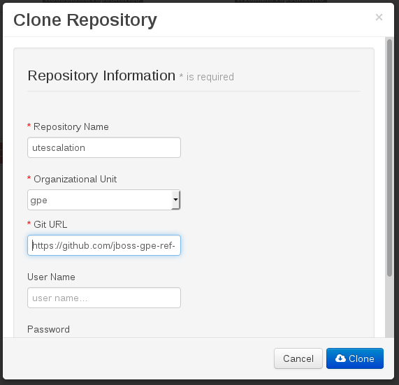

Enter _utescalation_ as the value of the _repository name_.
The value of _Git URL_ is the URL to this reference architecture in github:

-----
https://github.com/jboss-gpe-ref-archs/bpm_ut_escalation.git
-----

Once successfully cloned, BPM Suite 6 will pop-up a new dialog box with the message:  _The repository is cloned successfully_

=== BPM Suite 6:  Build and Deploy _processTier_ project
Build and Deploy the _processTier_ project by executing the following:

. Navigate to `Authoring -> Project Authoring`
. In the `Project Explorer` panel, ensure that `gpe -> utescalation -> processTier` is selected
+
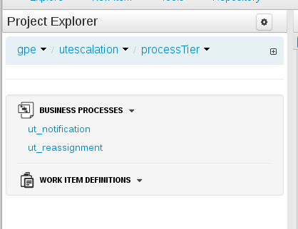

. Navigate to `Authoring -> Project Authoring -> Tools -> Project Editor`
. In the `Project Editor` panel, click `Build and Deploy`
. If interested, verify deployment:
.. Deploy -> Deployments
+
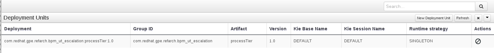

== Testing

Two BPMN2 process definitions are provided in the _processTier_ KIE project, 'ut_reassignment' for testing task reassignment, and 'ut_notification' for task notification. These processes can be started manually through BPM Central.

=== Testing User Task reassignment

The 'ut_reassignment' process can be used to test out User Task reassignment. This is a simple process definition with only one User Task node. The process takes a number of process variables for dynamically assigning the User Task and configuring reassignent.

To test out User Task reassignment:

. Log in into BPM Central using the `jboss/brms` username, password.
. In the `BPM Console`, navigate to `Process Management -> Process Definitions`.
. Select the _Start_ icon of the `ut_reassignment` process definition.
. A form appears where you can enter the process variables to test out task reassignment. For example:
+
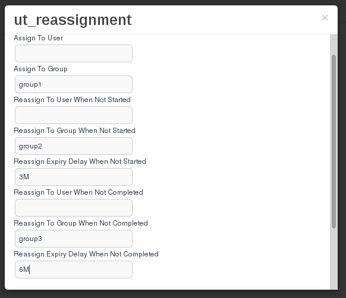

. The values as seen in the screenshot will allocate the User Task to group _group1_. If the task is not started within 3 minutes after task creation, the task will be reassigned to group _group2_. If the task has no been completed within 6 minutes, it will be reassigned to group _group3_. +
For this example to work correctly you provide at least one user or group for assignment, reassignment when not started and reassignent when not completed. An expiry delay for not started and not completed should also be provided.
. Click the _Play_ button on the bottom of the form.

You can now verify the behavior of User Task reassignment by logging out of BPM Central and logging in again as one of the users of _group1_, _group2_ or _group3_. Depending on the state of the User Task and the time after User task creation, tasks will appear or disappear in the Task list.

=== Testing User Task notification

The 'ut_notification' process can be used to test out User Task notification. This is also a simple process definition with only one User Task node. The process takes a number of process variables for dynamically assigning the User Task and configuring notification.

To test out User Task notification:

. Log in into BPM Central using the `jboss/brms` username, password.
. In the `BPM Console`, navigate to `Process Management -> Process Definitions`.
. Select the _Start_ icon of the `ut_reassignment` process definition.
. A form appears where you can enter the process variables to test out task reassignment. For example:
+
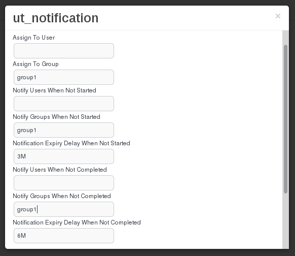

. The values as seen in the screenshot will allocate the User Task to group _group1_. If the task is not started within 3 minutes after task creation, a notification email will be sent to _group1_. If the task has no been completed within 6 minutes, a second notification email will be sent to _group1_ +
For this example to work correctly you need to provide at least one user or group for assignment, notification when not started and notification when not completed. An expiry delay for not started and not completed should also be provided.
. Click the _Play_ button on the bottom of the form.

You can now verify the behavior of User Task notification by checking the mailboxes of the users as configured in the `userinfo.properties` file. +
Please note that apart from the users or groups configured in the notification configuration, Business Administrators will also receive a notification email. If not explicitly set as part of the User task definitions, Business Administrators include the _Administrator_ user, and the _Administrators_ group. In our test setup, we have defined a user `busadmin` member of the Administrators group, so this user will receive all notification emails.
